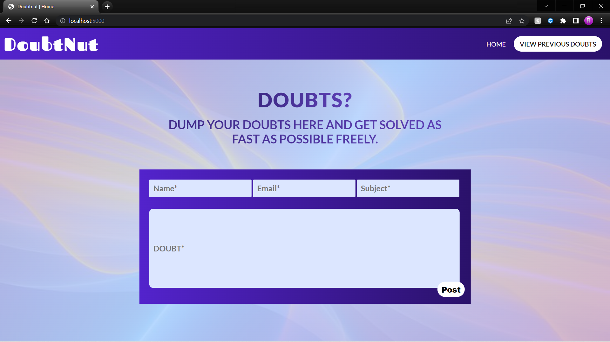
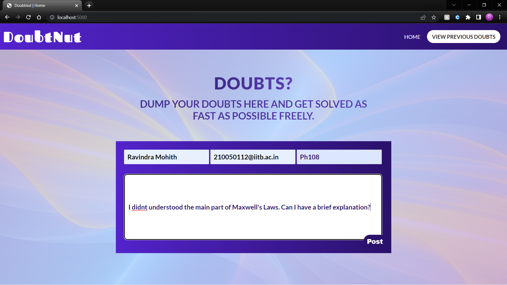
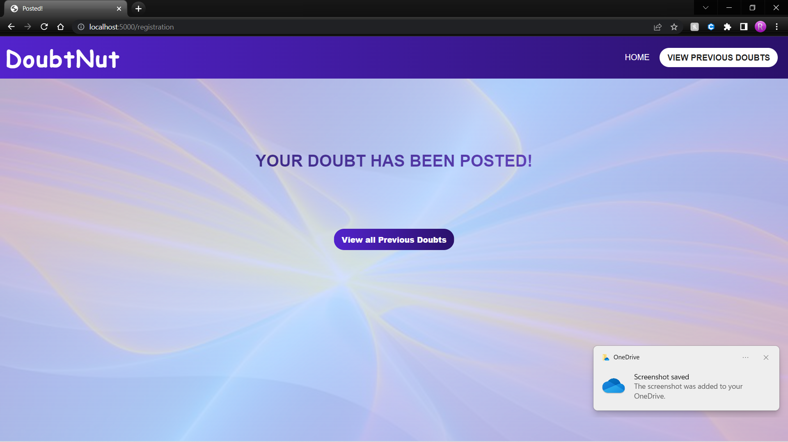
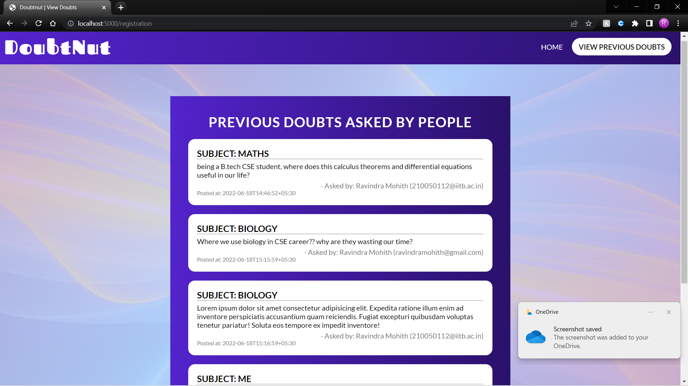

# CRUD-NodeExpressMongoDB
Basic CRUD Web-App

## Tech Stacks:
- Node.js,Express.js (Server Side).
- MongoDB{NoSQL} (DataBase).
- Handlebars{Express view engine} (Cliet Side).

## Getting started:
- Firstly, hit `npm install` to install all node_modules. 
- Then, navigate all the way through `cd src`.
- Then, hit `nodemon app.js` or `npm run dev` to start server.
- It will Firstly, chooses a port(which will be displayed on console) and runs on it.
- Secondly, it connects to the **Local MongoDB** by current IP address, and creates a new DB called *test*.

## Brief Description: 

- **Models**: 
Basically,this app contains doubt model in it.

- **Views**: 
Firstly, I installed handlebars library from npm.Then, I just set the paths to static, templates,partials(components basically which can be used multiply).Then, I registered the partials and templates to the handlebars(view engine), Then rendered the web pages dynamically by different http requests.

- **db**:
Coming to db side,with help ***mongoose*** module (which can be installed by npm install mongoose), We can just connect to Database(by passing mongo URL{In this app, I used localhost})which allows us to manuplate data(add and Read from DB).

## ScreenShots:

